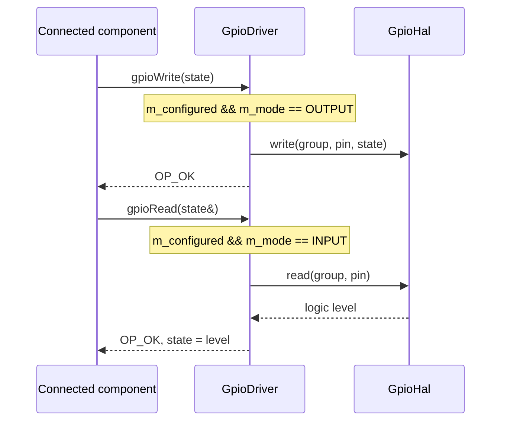
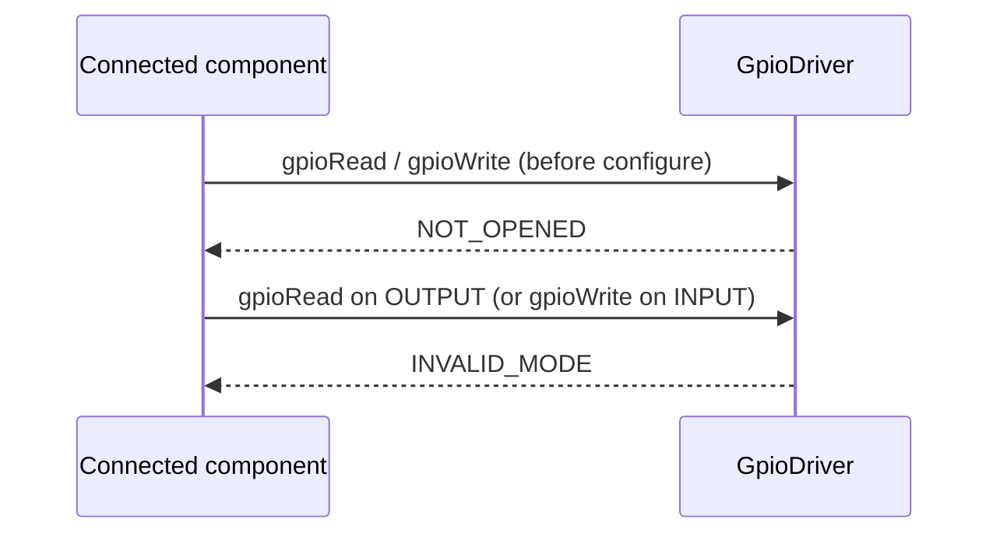

# Samd21::GpioDriver

Driver for the PORT (GPIO) SAMD21 Peripheral.

## Introduction

`GpioDriver` is a passive component that drives a single SAMD21 GPIO pin. It
implements the standard F´ `Drv.Gpio` interface (`gpioRead` / `gpioWrite`), so
it is a drop-in provider for any component that consumes a GPIO port. Each
instance is bound to one pin and one direction, selected at configuration time
via either `configureInput` or `configureOutput`. Reads and writes are
synchronous and go directly to the PORT peripheral registers through a thin
hardware abstraction layer (`GpioHardware::GpioHal`).

> Note: the interface's `gpioInterrupt` output port is not implemented and is
> never invoked. Any topology that connects `gpioInterrupt` (e.g. to an
> edge-notification handler) will therefore never receive a call on that port.

## Requirements

| Name     | Description                                                                                                                          | Rationale                                               | Validation                                                             |
| -------- | ------------------------------------------------------------------------------------------------------------------------------------ | ------------------------------------------------------- | ---------------------------------------------------------------------- |
| GPIO-001 | `configureInput` / `configureOutput` shall bind the instance to one group/pin in the corresponding I/O direction and forward the configuration to the PORT peripheral. | An instance controls exactly one pin.                   | UT `testConfigureOutput`, `testConfigureInput`, `testConfigureAllPins` |
| GPIO-002 | `configureInput` shall select a pull-up, pull-down, or no internal resistor via `InputPullMode`.                                    | Floating inputs must be pull-able for reliable sensing. | UT `testConfigureInput`                                                |
| GPIO-003 | `gpioWrite` shall set the pin logic level and return `OP_OK` when the pin is configured as an output.                                | Nominal output path.                                    | UT `testWriteNominal`                                                  |
| GPIO-004 | `gpioRead` shall return the pin logic level and `OP_OK` when the pin is configured as an input.                                      | Nominal input path.                                     | UT `testReadNominal`                                                   |
| GPIO-005 | `gpioRead` / `gpioWrite` shall return `NOT_OPENED` if invoked before `configureInput` / `configureOutput`.                          | Reject use of an unconfigured pin.                      | UT `testReadUnconfigured`, `testWriteUnconfigured`                     |
| GPIO-006 | `gpioRead` on an output pin, or `gpioWrite` on an input pin, shall return `INVALID_MODE` without touching hardware.                  | Enforce the pin's configured direction.                 | UT `testReadWrongMode`, `testWriteWrongMode`                           |

## Design

### Ports


Inherited from the `Drv.Gpio` interface:

| Port            | Kind       | Purpose                                            |
| --------------- | ---------- | -------------------------------------------------- |
| `gpioRead`      | sync input | Read the logic level of the configured input pin.  |
| `gpioWrite`     | sync input | Write a logic level to the configured output pin.  |
| `gpioInterrupt` | output     | Declared by the interface but **not implemented**. |

### State

The component stores its configuration in member state: a `m_configured`
flag, the pin `m_group` / `m_pin`, and the I/O `m_mode` (an internal enum set
implicitly by which configure method was called). Exactly one of
`configureInput` / `configureOutput` may be called per instance (guarded by
`FW_ASSERT(!m_configured)`); it records the state and delegates register setup
to `GpioHal::configureInput` / `GpioHal::configureOutput`.

The handlers are guard-then-delegate:

1. If `!m_configured` return `NOT_OPENED`.
2. If the requested operation does not match `m_mode` return `INVALID_MODE`.
3. Otherwise call `GpioHal::read` / `GpioHal::write` and return `OP_OK`.

### Sequence Diagrams

**Configuration (once, at topology setup):**

```mermaid
sequenceDiagram
    participant Top as Topology (startTasks)
    participant Drv as GpioDriver
    participant Hal as GpioHal
    alt output pin
        Top->>Drv: configureOutput(group, pin)
        Note over Drv: FW_ASSERT(!m_configured); m_mode = OUTPUT
        Drv->>Hal: configureOutput(groupIdx, pinIdx)
    else input pin
        Top->>Drv: configureInput(group, pin, pull)
        Note over Drv: FW_ASSERT(!m_configured); m_mode = INPUT
        Drv->>Hal: configureInput(groupIdx, pinIdx, pull)
    end
    Hal-->>Drv: (PORT registers set)
    Drv->>Drv: m_configured = true
```

**Nominal write / read:**



**Error paths (hardware is never touched):**



### Hardware Abstraction Layer

All register access is isolated behind `GpioHardware::GpioHal`
(`configureInput` / `configureOutput` / `read` / `write`). The SAMD21
implementation (`GpioDriverHardware.cpp`) manipulates the PORT `DIRSET`/`DIRCLR`,
`OUTSET`/`OUTCLR`, `IN`, and `PINCFG` registers. A stub implementation
(`GpioDriverHardwareStub.cpp`) is compiled for native/test builds and records
interactions so the driver can be unit-tested off-target. Selection is made in
`CMakeLists.txt` based on `FPRIME_PLATFORM`.

## Configuration

Call exactly one of `configureInput` / `configureOutput` once after construction
and before any port invocation. The chosen method fixes the pin direction, so
there is no separate `mode` argument.

**`configureInput(group, pin, input_pull_mode)`**

- `group` — `Group::PA` or `Group::PB`.
- `pin` — `Pin::PIN_0` .. `Pin::PIN_31`.
- `input_pull_mode` — `InputPullMode::NO_PULL`, `PULL_DOWN`, or `PULL_UP`.
  Selects the internal pull resistor for the input pin.

**`configureOutput(group, pin)`**

- `group` — `Group::PA` or `Group::PB`.
- `pin` — `Pin::PIN_0` .. `Pin::PIN_31`.

Example (from `Breadboard_Curiosity` topology, `startTasks` phase):

```cpp
inPA23.configureInput(Samd21::GpioDriver::Group::PA,
                      Samd21::GpioDriver::Pin::PIN_23,
                      Samd21::GpioDriver::InputPullMode::PULL_UP);
outPA25.configureOutput(Samd21::GpioDriver::Group::PA,
                        Samd21::GpioDriver::Pin::PIN_25);
```

## Tested Configurations

| Board Name               | Chip       | Instances                  | Pins            | Ops tested          | Result |
| ------------------------ | ---------- | --------------------------- | --------------- | ------------------- | ------ |
| Microchip Curiosity Nano | SAMD21G17A | `inPA23`, `outPA25`          | PA23 (in), PA25 (out) | configure, gpioRead, gpioWrite | Pass   |

Verified by flashing the `Breadboard_Curiosity` deployment and exercising both
instances: `outPA25` drives its pin high/low on command, and `inPA23` (pulled
up) reads back the expected logic level. As expected from the `gpioInterrupt`
limitation noted above, `pinIn.transitionIn` never fires — this was confirmed
on hardware and matches the documented behavior; it is not a defect.
