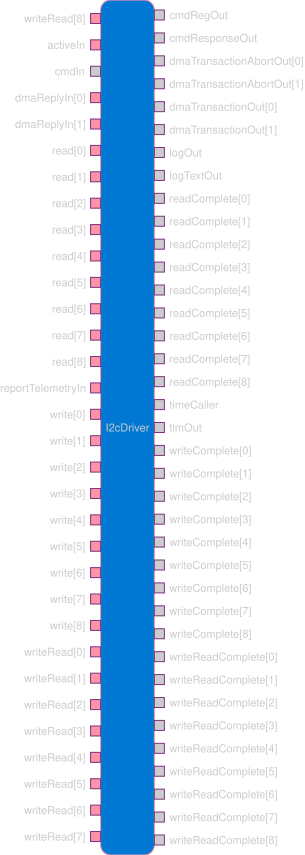

# Samd21::I2cDriver

Driver for the SAMD21 SERCOM peripheral in I2C Host (master) mode.

## 1. Introduction

The `Samd21::I2cDriver` component drives a SAMD21 SERCOM peripheral as an I2C
host (master). It is a passive, DMA-driven component: the data payload of every
transaction is moved by the DMA controller rather than the CPU, and the driver
runs without an RTOS thread.

The driver exposes three asynchronous operations — `write`, `read`, and
`writeRead` — each with a matching completion callback. A `writeRead` is a
combined transaction that issues a repeated START between the write and the read
(no STOP in between), so the addressed device keeps its internal register pointer
across the two phases. This is the access pattern register-based devices such as
the LTC2945 power monitor require.

Because there is no RTOS, transaction *outcomes* are detected in interrupt
context, but the client completion callbacks are **not** invoked from the ISR.
The ISR records the outcome and the callback is delivered later from the
`activeIn` tick, which runs in the main context (see §3.1).

## 2. Requirements

| Name           | Description                                                                                                                                                          | Validation    |
| -------------- | -------------------------------------------------------------------------------------------------------------------------------------------------------------------- | ------------- |
| SAMD21-I2C-001 | The I2cDriver shall configure a SERCOM peripheral for I2C host operation with configurable SCL frequency (100kHz / 400kHz / 1MHz / 3.4MHz), SDA hold, and pin usage. | Hardware Test |
| SAMD21-I2C-002 | The I2cDriver shall perform 7-bit-addressed write, read, and combined write-read transactions using DMA for the data payload.                                        | Hardware Test |
| SAMD21-I2C-003 | The I2cDriver shall implement `writeRead` as a repeated START with no intervening STOP.                                                                              | Hardware Test |
| SAMD21-I2C-004 | The I2cDriver shall report bus errors as events, count them in telemetry, and fail the in-flight transaction with the appropriate status.                            | Hardware Test |
| SAMD21-I2C-005 | The I2cDriver shall reject a new request that arrives while a transaction is in progress, returning `I2C_OTHER_ERR` on the matching completion callback.             | Hardware Test |
| SAMD21-I2C-006 | The I2cDriver shall deliver every completion callback from the main context (via `activeIn`), not from interrupt context.                                            | Unit Test     |
| SAMD21-I2C-007 | The I2cDriver shall force-recover a transaction whose completion interrupt is lost, reply to the caller with an error, and return to service.                        | Unit Test     |

## 3. Design

### 3.1 Overview

`Samd21::I2cDriver` is a passive component presenting the `AsyncSyncI2c`
interface: three request ports (`write`, `read`, `writeRead`) with matching
completion callbacks. Only one transaction may be in flight at a time; a request
that arrives while the driver is busy is rejected immediately on its completion
callback with `I2C_OTHER_ERR`.

The data payload is transferred by the `Samd21::DmaDriver` over **two DMA
channels** — one for transmit, one for receive. Two channels are required because
a DMA channel has a single trigger source, and the write and read phases use
different SERCOM triggers. Using separate channels also lets the read transfer be
armed ahead of time so the write→read transition never has to set up DMA from
within an interrupt.

Transaction outcomes (success and bus errors) are detected in interrupt context
(the DMA `dmaReplyIn` and the SERCOM error / master-on-bus interrupts), but the
completion callback is **not** invoked from there. Instead the ISR records the
outcome — it moves the driver into a terminal `COMPLETE_*` state and stores the
resulting `I2cStatus` — and the client callback is delivered later from the
`activeIn` tick, which runs in the main context off a `PassiveCycler`. This means
**completion callbacks run in the main loop, not ISR context**, so client handlers
are free to do ordinary work (telemetry, events, replies). The driver stays
non-IDLE (and rejects new requests as busy) between the ISR recording the
completion and `activeIn` delivering it. `activeIn` must therefore be connected
for the driver to function.



Telemetry (`reportTelemetryIn`) and completion delivery (`activeIn`) are both
driven from rate groups / a cycler in the main context; nothing in the driver's
critical path runs a client callback from the ISR.

### 3.2 Ports

| Kind         | Name                                | Port Type                  | Usage                                                |
| ------------ | ----------------------------------- | -------------------------- | ---------------------------------------------------- |
| `sync input` | `write[I2cClientPorts]`             | `Drv.I2cRequest`           | Start a write transaction                            |
| `sync input` | `read[I2cClientPorts]`              | `Drv.I2cRequest`           | Start a read transaction                             |
| `sync input` | `writeRead[I2cClientPorts]`         | `Drv.I2cWriteReadRequest`  | Start a combined write-then-read (repeated START)    |
| `output`     | `writeComplete[I2cClientPorts]`     | `Drv.I2cCallback`          | Write completion + status (from main context)        |
| `output`     | `readComplete[I2cClientPorts]`      | `Drv.I2cCallback`          | Read completion + status (from main context)         |
| `output`     | `writeReadComplete[I2cClientPorts]` | `Drv.I2cWriteReadCallback` | Write-read completion + status (from main context)   |
| `output`     | `dmaTransactionOut[N]`              | `Dma.Transaction`          | Queue a DMA transfer on the WRITE or READ channel    |
| `output`     | `dmaTransactionAbortOut[N]`         | `Fw.Signal`                | Abort a channel's DMA transfer (error teardown)      |
| `sync input` | `dmaReplyIn[N]`                     | `Dma.TransactionReply`     | DMA completion from the DMAC (ISR context)           |
| `sync input` | `activeIn`                          | `Svc.ActiveSched`          | Main-context tick that delivers pending completions  |
| `sync input` | `reportTelemetryIn`                 | `Svc.Sched`                | Periodic tick: emits telemetry and runs the watchdog |
| `time get`   | `timeCaller`                        | —                          | Timestamp source for telemetry                       |

The standard command / event / telemetry ports are also present via the
`Fw.Command`, `Fw.Event`, and `Fw.Channel` imports.

`activeIn` returns `bool`: `true` when a completion was delivered this tick (so
the cycler re-invokes the driver), `false` when there was nothing pending.

The client-facing request/callback ports are arrayed by the `Samd21.I2cClientPorts`
config constant, so one driver instance can be shared by several components on the
same bus. A completion is always returned on the same port index the request
arrived on.

The DMA ports are arrayed and indexed by a `DmaChannel` enum (`WRITE`, `READ`).
Each index must be wired to a distinct physical DMA channel in the topology.

### 3.3 Configuration

#### 3.3.1 Runtime (`configure()`)

`configure()` sets up the SERCOM once at startup. The caller selects:

| Option             | Choices                                                                 |
| ------------------ | ----------------------------------------------------------------------- |
| SERCOM instance    | `SERCOM_0` … `SERCOM_5` (device-dependent)                              |
| SCL frequency      | 100 kHz, 400 kHz, 1 MHz, or 3.4 MHz                                     |
| SDA hold time      | Disabled, 75 ns, 450 ns, or 600 ns                                      |
| Pin usage          | Two-wire (SCL/SDA) or four-wire                                         |
| Clock stretch mode | Always, or only after ACK                                               |
| SMBus time-outs    | SCL-low, inactive-bus, host SCL-extend, client SCL-extend (each on/off) |
| Run in standby     | Enabled or disabled                                                     |

The driver uses 7-bit addressing and transfers up to 255 bytes per transaction.

`configure()` asserts it has not already been called and that the driver is IDLE,
then registers the component's ISR trampoline, programs the SERCOM through the
HAL, and marks the driver configured. All hardware sync-busy waits inside the HAL
are bounded by an `F_CPU` cycle budget and assert on time-out rather than hanging.

**Clocking.** The SERCOM core clock (which sets the SCL baud rate) is taken from
the 48 MHz main clock generator. The SMBus time-outs are clocked by the separate,
SERCOM-wide "slow" clock, which the driver routes from a 32.768 kHz generator. If
the slow clock is not present, any enabled time-out never fires — so the driver
always configures it during `configure()`. On this project that 32.768 kHz
generator is sourced from the internal oscillator on bench (crystal-less) builds
and from the external crystal on flight builds; the driver does not need to know
which.

#### 3.3.2 Compile-time

Compile-time settings come from the project's `samd-config` module. The
library-default values are:

| Setting                                               | Where                 | Default | Effect                                                                                                          |
| ----------------------------------------------------- | --------------------- | ------- | --------------------------------------------------------------------------------------------------------------- |
| `Samd21.I2cClientPorts`                               | `Samd21I2cConfig.fpp` | 2       | Number of client ports on the request/callback arrays (how many components share the driver)                    |
| `Samd21::I2cDriverConfig::I2C_ENABLE_DEBUG_TELEMETRY` | `I2cDriverConfig.hpp` | 1       | When 0, only `BusErrorCount` / `StallRecoveryCount` are emitted; the diagnostic channels and their per-tick bus-status read are skipped |
| `Samd21::I2cDriverConfig::I2C_STALL_RECOVERY_TICKS`   | `I2cDriverConfig.hpp` | 3       | Number of consecutive `reportTelemetryIn` ticks a transaction may remain in flight before the stall watchdog force-recovers it (§3.5.2) |

> A deployment may override these in its own `samd-config`. This project, for
> example, sets `I2cClientPorts = 9` (one client port per LTC2945 on the bus).

### 3.4 Transaction Behavior

- **Write** — the driver transmits the buffer to the device and completes with a
  STOP.
- **Read** — the driver reads the requested number of bytes from the device,
  ending with a NACK + STOP.
- **Write-read** — the driver transmits the write buffer, then issues a repeated
  START and reads the requested bytes, ending with a NACK + STOP. No STOP occurs
  between the two phases, so the device retains its register pointer. The read
  transfer is armed before the write completes, and the transition from writing
  to reading is driven by the SERCOM's "master on bus" interrupt so that the read
  START is issued at the correct moment (after the final write byte is on the
  bus, while the clock is held).

Each transaction ends by recording a status (`I2C_OK` on success, or an error
status) and moving to a terminal `COMPLETE_*` state. The matching completion
callback is then delivered on the next `activeIn` tick **from the main context**,
never from the ISR that finished the transaction.

#### State machine

The driver tracks its progress in a single `State` (member `m_state`). In-flight
states have a DMA transfer or interrupt outstanding; `COMPLETE_*` states are
terminal outcomes waiting only for `activeIn` to deliver the reply.

| State                     | Meaning                                                                              |
| ------------------------- | ------------------------------------------------------------------------------------ |
| `IDLE`                    | No transaction; new requests accepted.                                               |
| `READ`                    | RX DMA of a `read` in flight.                                                        |
| `WRITE`                   | TX DMA of a `write` in flight.                                                       |
| `WRITE_READ_WRITING`      | TX DMA of the write phase of a `writeRead` in flight (read DMA pre-armed).           |
| `WRITE_READ_WRITING_WAIT` | Write DMA done; MB interrupt armed, waiting for the master-on-bus handoff.           |
| `WRITE_READ_READING`      | RX DMA of the read phase of a `writeRead` in flight.                                 |
| `COMPLETE_READ`           | Terminal: read finished (OK or error); awaiting `activeIn` delivery.                 |
| `COMPLETE_WRITE`          | Terminal: write finished; awaiting `activeIn` delivery.                              |
| `COMPLETE_WRITE_READ`     | Terminal: write-read finished; awaiting `activeIn` delivery.                         |

Nominal flow: `read`/`write` run their single DMA to a `COMPLETE_*` state; a
`writeRead` runs the write DMA, hands off through `WRITE_READ_WRITING_WAIT` on the
master-on-bus interrupt (or inline if MB is already latched), runs the read DMA,
then reaches `COMPLETE_WRITE_READ`. A client NACK of the register-pointer write
short-circuits the handoff to `COMPLETE_WRITE_READ` with a write error. A SERCOM
bus error at any point aborts the in-flight DMA channel(s) and moves to the
matching `COMPLETE_*` state with an error status. From any in-flight state the
stall watchdog (§3.5.2) can force the driver back to `IDLE` and reply to the caller
with `I2C_OTHER_ERR`. Every `COMPLETE_*` state is drained by the next `activeIn`
tick, which delivers the reply and returns the driver to `IDLE`.

### 3.5 Error Handling

#### 3.5.1 Bus errors

The driver enables the SERCOM error interrupt. When a bus error is detected
(bus error, arbitration lost, an SMBus time-out, or a transaction-length error),
the driver:

- emits an `I2cBusError` event identifying the error (one per set error flag),
- increments the bus-error telemetry counter, and
- tears down the in-flight transaction (aborting its DMA) and **records** an error
  status; the matching completion callback fires later from `activeIn`.

Bus errors most often stem from the physical bus — missing or weak SDA/SCL
pull-ups, a line held low, or an enabled SMBus time-out tripping on a stalled
bus — so they are the first thing to check when a transaction fails.

A **DMA transfer error** (the DMAC reporting a non-OK status on `dmaReplyIn`) is
treated differently. On the SAMD21 a DMAC transfer error is an AHB bus fault
(invalid transfer address, an MPU/access violation, a malformed descriptor) — it
signals that the *transaction was set up incorrectly*, which is a software defect,
not a runtime I2C-bus condition. The driver therefore `FW_ASSERT`s that every DMA
reply status is `OK`; a transfer error is a programming error that should surface
loudly (assert / reset) rather than be silently recovered.

For a `writeRead`, the driver also checks that the device acknowledged the write
(register-pointer) phase before issuing the repeated START. If the device NACKs,
the write-read is failed with a write error and the read is not attempted.

A DMA completion that does not match the expected channel/state is reported via
the `InvalidDmaReply` / `UnexpectedInterrupt` events and fails/ignores the reply
rather than asserting.

#### 3.5.2 Stall watchdog

A healthy transaction completes in milliseconds, well within one
`reportTelemetryIn` tick. If a completion interrupt is *lost* — for example a
hardware SCL time-out auto-STOPs the bus but the completion never propagates —
the driver would otherwise stay non-IDLE forever and reject all future requests.

To guard against this, `reportTelemetryIn` runs a stall watchdog. It counts
consecutive ticks the driver has been in an in-flight state (the `COMPLETE_*`
states do not count — they are already finished and only waiting on `activeIn`).
When the count reaches `I2C_STALL_RECOVERY_TICKS`, the watchdog:

- atomically captures the stuck state and sets `m_state = IDLE` under a critical
  section (so a completion ISR that races in is dropped by the IDLE guards),
- snapshots the frozen `INTFLAG`/`STATUS` registers into a
  `StalledTransactionRecovered` event for post-hoc diagnosis,
- aborts whichever DMA channels the stuck transaction could have had in flight,
- resets the peripheral bus state to IDLE and disables the MB interrupt, and
- replies to the stuck caller with `I2C_OTHER_ERR` so its own state machine
  unwinds instead of waiting forever,

then increments the `StallRecoveryCount` telemetry counter. The potentially long
recovery work (event, DMA aborts, HAL reset, port reply) runs *outside* the
critical section.

### 3.6 Completion delivery (`activeIn`)

`activeIn` is the main-context tick that delivers a recorded completion. Under a
critical section it snapshots `m_state`/`m_pendingStatus`; if the state is a
`COMPLETE_*`, it captures the status, returns the driver to `IDLE`, and then —
outside the critical section — invokes the matching completion callback with the
transaction's buffers. It returns `true` when it delivered a completion and
`false` when nothing was pending. The client callback may itself issue a new
request re-entrantly; the buffers are captured into locals before the callback
runs, so this is safe.

### 3.7 Telemetry, Events, and Commands

| Kind      | Name                          | Description                                                             |
| --------- | ----------------------------- | ----------------------------------------------------------------------- |
| Telemetry | `BusErrorCount`               | Running count of detected bus errors (always emitted)                   |
| Telemetry | `StallRecoveryCount`          | Running count of stalled transactions force-recovered (always emitted)  |
| Telemetry | `BusState`                    | Current bus state (unknown / idle / owner / busy) †                     |
| Telemetry | `ClockHold`                   | Host is holding SCL waiting on software/DMA †                           |
| Telemetry | `ReceiveNotAcknowledged`      | Last address/data byte was NACKed †                                     |
| Telemetry | `DeviceOnBus`                 | Master/client on-bus status †                                           |
| Event     | `I2cBusError`                 | A bus error was detected (warning/low)                                  |
| Event     | `UnexpectedInterrupt`         | Interrupt taken in an unexpected state (warning/high)                   |
| Event     | `InvalidDmaReply`             | DMA reply for the wrong channel/state (warning/high)                    |
| Event     | `StalledTransactionRecovered` | The stall watchdog force-recovered a wedged transaction (warning/high)  |
| Command   | `CLEAR_ERRORS`                | Reset the `BusErrorCount` counter                                       |

† Diagnostic channels, emitted only when `I2C_ENABLE_DEBUG_TELEMETRY` is non-zero
(see §3.3.2). `BusErrorCount` and `StallRecoveryCount` are always emitted.

## 4. Integration

### 4.1 Initialization

Configure the SDA/SCL GPIO pin muxing (via `Samd21::PinMux::configure()`) **before**
calling `configure()`. `configure()` may be called only once, and requires the
`Samd21::DmaDriver` to be configured as well since the driver relies on it for all
transfers.

For a single-master bus during bring-up, leaving the SMBus time-outs disabled is
the simplest starting point. The SCL-low time-out is worth enabling in operation
for automatic stuck-bus recovery, at the cost of a reported bus error whenever it
trips.

### 4.2 Topology Connections

Each DMA channel needs its own physical DMAC channel wired for transactions,
aborts, and completion replies. `activeIn` must be connected to a cycler and
`reportTelemetryIn` to a rate group. The device component connects to whichever
request/callback ports it uses (a register-based sensor typically uses only
`writeRead`).

```fpp
enum DmaChannel : U8 {
  # ... other channels ...
  SERCOM4_I2C_WRITE,
  SERCOM4_I2C_READ,
}

connections I2c {
  # WRITE channel
  i2cDriver.dmaTransactionOut[Samd21.I2cDriver.DmaChannel.WRITE]
      -> dmaDriver.sendTransactionIn[DmaChannel.SERCOM4_I2C_WRITE]
  i2cDriver.dmaTransactionAbortOut[Samd21.I2cDriver.DmaChannel.WRITE]
      -> dmaDriver.abortTransactionIn[DmaChannel.SERCOM4_I2C_WRITE]
  dmaDriver.transactionIsrOut[DmaChannel.SERCOM4_I2C_WRITE]
      -> i2cDriver.dmaReplyIn[Samd21.I2cDriver.DmaChannel.WRITE]

  # READ channel
  i2cDriver.dmaTransactionOut[Samd21.I2cDriver.DmaChannel.READ]
      -> dmaDriver.sendTransactionIn[DmaChannel.SERCOM4_I2C_READ]
  i2cDriver.dmaTransactionAbortOut[Samd21.I2cDriver.DmaChannel.READ]
      -> dmaDriver.abortTransactionIn[DmaChannel.SERCOM4_I2C_READ]
  dmaDriver.transactionIsrOut[DmaChannel.SERCOM4_I2C_READ]
      -> i2cDriver.dmaReplyIn[Samd21.I2cDriver.DmaChannel.READ]

  # Main-context ticks
  cycler.cycleOut          -> i2cDriver.activeIn
  rg1Hz.RateGroupMemberOut -> i2cDriver.reportTelemetryIn

  # Device <-> driver
  testSensor.i2cWriteRead     -> i2cDriver.writeRead
  i2cDriver.writeReadComplete -> testSensor.writeReadComplete
}
```

**Wiring requirements:**
- The WRITE and READ DMA ports must map to **two distinct physical DMA channels**.
- `activeIn` must be connected (to a `PassiveCycler`) or completions are never
  delivered.
- `reportTelemetryIn` should be connected to a rate group so telemetry is emitted
  and the stall watchdog runs.

## 5. Tested Configurations

| Board Name               | Chip       | SERCOM  | Pins        | Speed   | Device  | Ops tested       | Result |
| ------------------------ | ---------- | ------- | ----------- | ------- | ------- | ---------------- | ------ |
| Microchip Curiosity Nano | SAMD21G17A | SERCOM4 | PA12 / PA13 | 400 kHz | LTC2945 | write, writeRead | Pass   |

Verified end-to-end by reading LTC2945 registers over `writeRead` and confirming
the decoded ADC values are self-consistent and track the device's min/max hold
registers, demonstrating live repeated-START reads.

## 6. Limitations

- One transaction in flight at a time; concurrent requests are rejected with
  `I2C_OTHER_ERR`.
- Up to 255 bytes per transaction.
- 7-bit addressing only; High-speed master-code arbitration is not implemented.
- Completion callbacks run in the **main context** (delivered by `activeIn`), so
  `activeIn` must be connected; a completion is not delivered until the next tick.
- Configuration is one-time; no runtime reconfiguration.
- The stall watchdog only runs while `reportTelemetryIn` is ticking; recovery
  latency is up to `I2C_STALL_RECOVERY_TICKS` ticks.
